# Table It D365FO

Table It D365FO is a Chrome extension for Microsoft Dynamics 365 Finance and Operations. It helps developers, admins, and analysts browse tables, inspect data entities, build OData URLs, view entity data, and trace table relationships without leaving the browser.

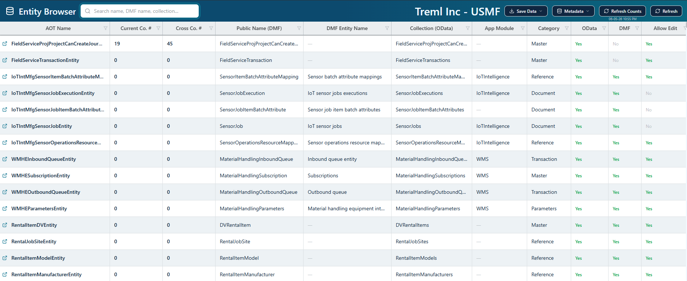

## Getting Started As A User

1. Install the extension.
2. Open the extension popup and go to settings.
3. Add one or more Dynamics 365 Finance and Operations environments.
4. Enter the base environment URL and default company.
5. Sign in to that D365FO environment in the same browser.
6. Use the popup to open Table Browser, Entity Browser, or Relation Paths.

The extension uses your existing browser session for D365FO. It does not ask for your password or provide its own login flow.

## Features

- Browse D365FO tables with searchable metadata, favorites, and direct table browser links.
- Browse data entities with current-company and cross-company record counts.
- Inspect entity details, OData names, DMF metadata, fields, and enum values.
- Build OData URLs with `$select`, `$filter`, `$top`, `$skip`, `$count`, and `cross-company`.
- Open generated OData calls in a grid, copy URLs, and export loaded entity data.
- Find table relationship paths and view generated SQL-style and X++-style joins.
- Manage multiple D365FO environments and company codes from the extension settings.
- Use light, dark, auto, and custom color themes.

## Feature Walkthrough

### Settings

Create and switch between environment profiles, company IDs, and color themes.

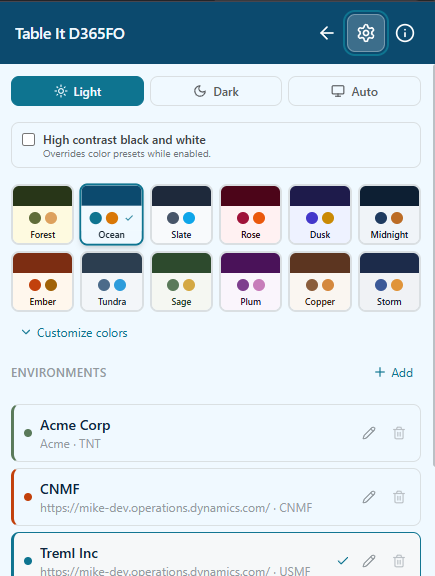

### Table Browser

Use Table Browser when you know the table name, label, module, group, or form reference and want to find the matching D365FO table quickly. The first column opens the D365FO table browser link when the table can be opened by URL. The top bar toggle lets you hide or show temp and staging tables.

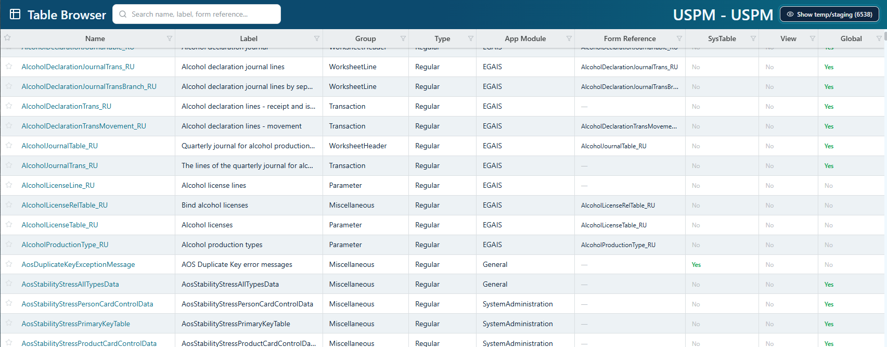

### Entity Browser

Use Entity Browser to inspect live OData and DMF entity metadata from the selected environment. The grid shows current-company and cross-company record counts, public names, DMF names, collection names, module, category, OData availability, DMF availability, and editability.


### Entity Details

Click an entity row to open the side panel. Entity Details shows OData, DMF, and DMF Active status, AOT name, public name, collection, category, app module, change tracking, DMF entity name, staging table, entity key, label ID, configuration key, and tags.

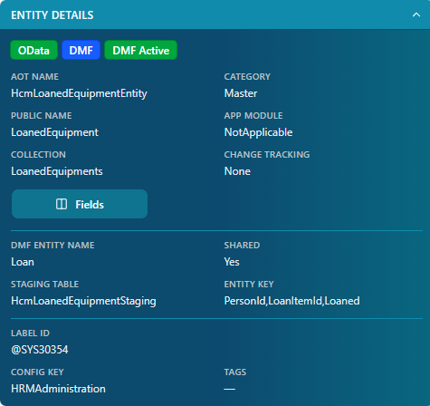

### Entity Fields

Open Fields from the entity side panel to inspect field labels, label IDs, types, type names, data types, keys, required flags, configuration, editability, on-create behavior, and dimension fields. Search and filter columns to narrow long field lists.

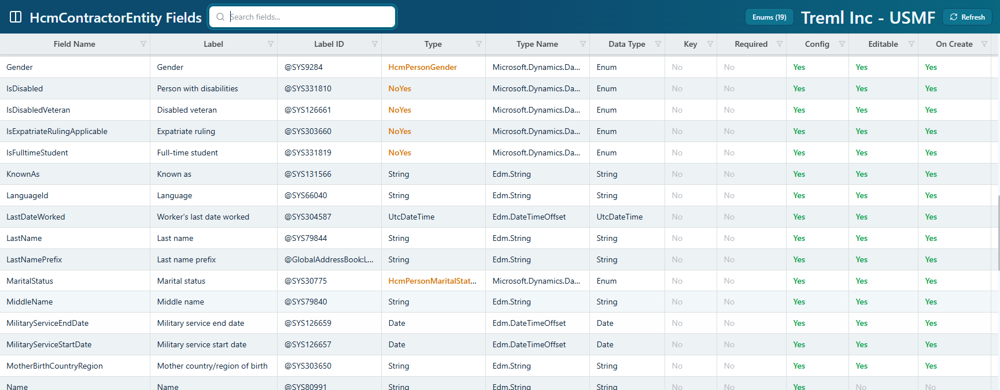

### Enum Values

For enum fields, select the enum type to view the available enum values. This helps translate stored numeric values into readable D365FO enum names.

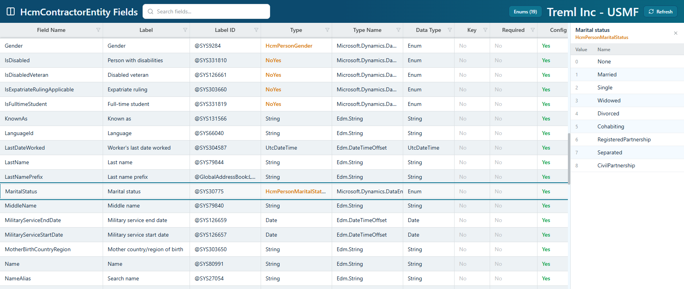

### Select Fields

Use the `$select` section to choose which entity fields should be returned by OData. Move one or more fields into the selected list; leaving the selected list empty returns all fields.

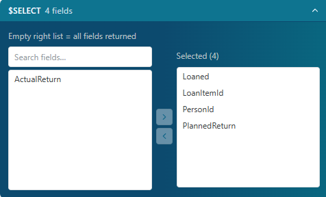

### Filters

Use `$filter` to build simple OData conditions without typing the full URL by hand. Conditions are based on the selected entity fields and operators.

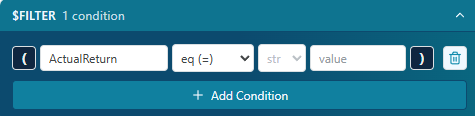

### Pagination And Options

Set `$top` for max records, `$skip` for offset, `$count=true` when you need counts, and `cross-company=true` when the OData call should include all companies available to your D365FO user.

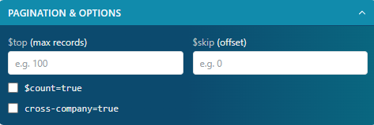

### Generated URL

Review the generated OData URL, copy it, open it in the extension grid view, or call `/$count` for count-only checks.

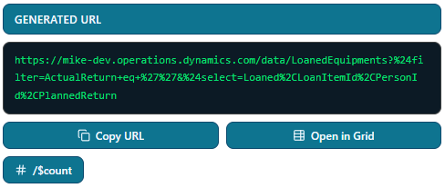

### Entity Data Grid

Open an entity URL in the grid to view returned OData records. You can adjust `$top`, refresh, copy/open the source URL, export loaded records, and hide empty or zero values while reviewing the data.

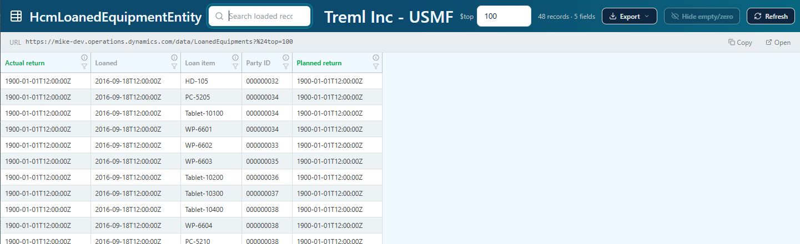

### Export

Use export menus to download loaded entity metadata or loaded data as JSON or CSV. Exports are based on what the extension has loaded.

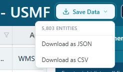

### Relation Paths

Use Relation Paths to find how two D365FO tables or entities may connect. Enter a start object and an end object, choose connection depth, and narrow the relationship graph by object type, module, country, or temp/staging table status.

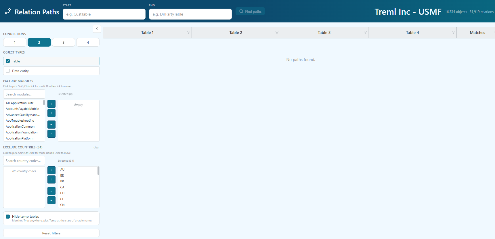

### Relation Results

Select a path result to see matching fields, relationship direction, SQL-style join text, and X++ while-select examples.

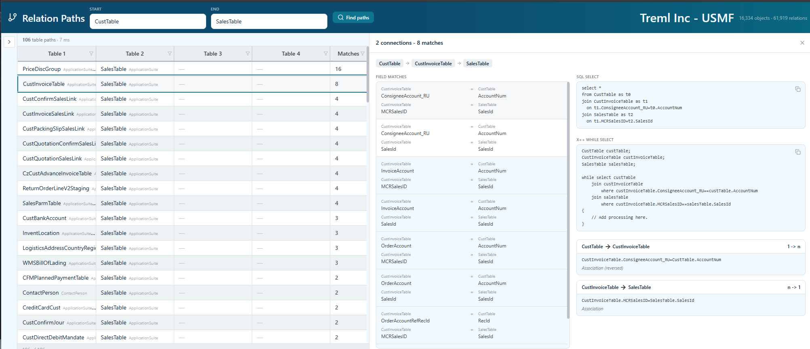

## Notes And Limits

- Users must already have access to the D365FO environment they configure.
- OData results depend on the user's D365FO security role, company context, and whether the entity is exposed through OData.
- Current-company counts use the selected/default company context.
- Cross-company counts use `cross-company=true`.
- Search and export on loaded data views apply to records that have been loaded into the page.

## Development Setup

### Prerequisites

- Node.js 18 or newer
- npm
- Chromium-based browser such as Chrome, Edge, or Brave

### Install

```bash
npm install
```

### Build

```bash
npm run build
```

The production build is written to `dist/`.

### Load The Extension

1. Open `chrome://extensions` in a Chromium-based browser.
2. Enable **Developer mode**.
3. Choose **Load unpacked**.
4. Select the `dist/` folder.

For Brave, use `brave://extensions` and load the same `dist/` folder.

## Development Commands

```bash
# Development build with watch mode
npm run dev

# Production build
npm run build

# Type checking
npm run type-check

# Linting
npm run lint
npm run lint:fix

# Formatting
npm run format
```

## Project Structure

```text
Table-It_D365FO/
|-- src/
|   |-- background/          # Extension service worker
|   |-- popup/               # Extension popup
|   |-- pages/               # Full-page extension views
|   |-- shared/              # Shared services, components, hooks, and utilities
|   `-- types/               # Shared TypeScript types
|-- public/                  # Manifest and icons
|-- webpack/                 # Build configuration
|-- docs/                    # Documentation and screenshots
`-- dist/                    # Build output, not committed
```

## Technology

- TypeScript and React for the extension UI.
- TanStack Table and virtualization for large metadata grids.
- React Query and Zustand for server data, caching, and local UI state.
- Fuse.js for fuzzy search.
- Webpack for Chrome extension builds.

## Privacy

The extension is designed to run locally in the browser against the D365FO environments you configure. Environment settings and cached metadata are stored in browser extension storage. The extension does not need a separate backend service to browse tables, entities, or OData metadata.

## Documentation

A printable feature guide is also available:

- [Feature Guide Markdown](docs/feature-guide.md)
- [Feature Guide PDF](docs/feature-guide.pdf)
- [Privacy Policy](docs/privacy-policy.md)

## License

This project is licensed under the MIT License. See [LICENSE](LICENSE).
