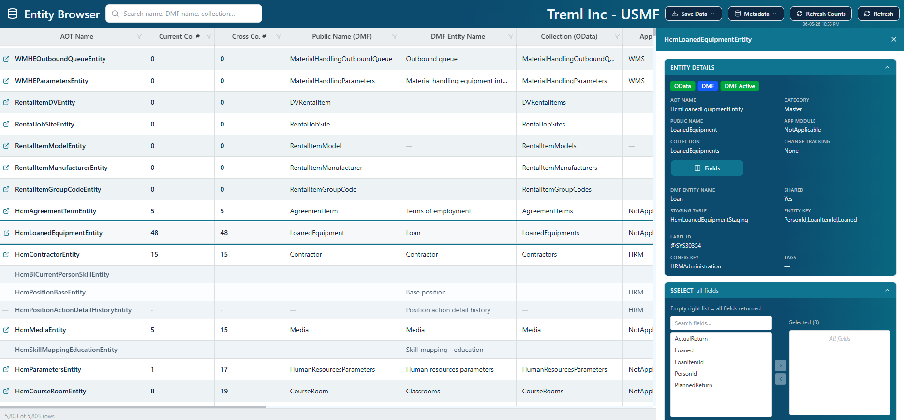

# Table It D365FO Feature Guide

This guide shows the main screens in Table It D365FO and briefly explains what each feature is used for.

## Settings

The Settings screen is where environments and appearance are managed. Users can choose light, dark, or automatic mode, enable high contrast, pick a color scheme, customize colors, and add or edit D365FO environment profiles.

## Table Browser

The Table Browser lists bundled D365FO tables with searchable columns for name, label, group, type, module, form reference, and table flags. Users can open a table in D365FO, mark favorites, filter columns, and show or hide temp/staging tables.

## Entity Browser

The Entity Browser lists D365FO data entities from the selected environment. It shows current-company and cross-company record counts, OData and DMF availability, entity names, collections, modules, and categories. Toolbar actions support exporting, metadata cache actions, count refresh, and entity refresh.

## Entity Export

The Save Data menu exports the entity list as JSON or CSV. Exported data includes the entity metadata shown in the browser and any loaded record count values.

## Entity Highlight And Side Panel

Selecting an OData-enabled entity opens the side panel. The selected row is highlighted in the grid while the panel shows entity details and query-building tools.

## Entity Details

The Entity Details section summarizes the selected entity. It shows OData, DMF, and DMF Active badges, AOT name, public name, collection, category, module, change tracking, staging table, key fields, label ID, configuration key, tags, and countries.

## Entity Fields Button

The Fields page shows the metadata fields for a selected data entity. It includes field names, labels, label IDs, types, data types, key status, required status, editability, and dimension-related properties.

## Entity Field Enum Values

When an enum field is selected, the enum panel shows the enum values and names. This helps translate stored numeric values into readable D365FO enum members.

## Select Fields

The `$select` section builds the OData field selection. Leaving the selected list empty returns all fields. Users can search fields, select multiple fields, and move them into the selected list.

## Filters

The `$filter` section builds OData filter conditions. Users can choose a field, operator, value type, value, parentheses, and AND/OR logic for multi-condition filters.

## Pagination And Options

The Pagination & Options section adds `$top`, `$skip`, `$count=true`, and `cross-company=true` to the generated OData URL.

## Generated URL

The Generated URL section previews the final OData URL. Users can copy the URL, open the result in the built-in data grid, or run `/$count` for the current query.

## Entity Data Grid

The Entity Data page loads records for an entity OData collection. It supports searching loaded records, changing `$top`, exporting the loaded data, hiding empty/zero columns, refreshing, column filters, sorting, resizing, pagination, and field information from headers.

## Relation Paths

Relation Paths finds relationship paths between D365FO objects. Users enter a start and end object, choose connection depth, filter object types, exclude modules or countries, and hide temp tables.

## Relation Path Results

Selecting a relation path opens the detail drawer. It shows field matches, path variants, generated SQL-style joins, generated X++ while-select code, cardinality, and copy buttons for generated snippets.

